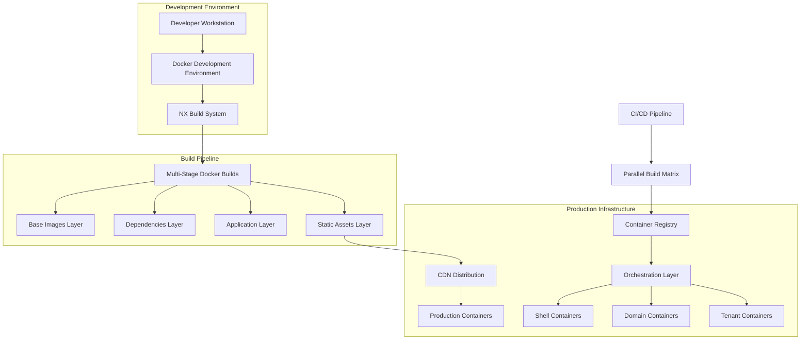

# Enterprise Docker Strategy for Zionix Micro-Frontend Platform

## 1. Architecture Overview

This document outlines a comprehensive Docker strategy for the Zionix micro-frontend platform, designed to scale to 10,000+ applications across multiple domains, teams, shells, and tenants using NX workspace, Module Federation, and RSPack.



## 2. Multi-Stage Build Strategy

### 2.1 Base Image Hierarchy

**Base Node.js Image**
```dockerfile
# docker/base/node.Dockerfile
FROM node:18-alpine AS base
LABEL maintainer="Zionix Platform Team"

# Install system dependencies
RUN apk add --no-cache \
    git \
    python3 \
    make \
    g++ \
    && rm -rf /var/cache/apk/*

# Set working directory
WORKDIR /app

# Create non-root user
RUN addgroup -g 1001 -S nodejs && \
    adduser -S nextjs -u 1001

# Install global dependencies
RUN npm install -g @nx/cli@latest
```

**NX Workspace Base**
```dockerfile
# docker/base/nx-workspace.Dockerfile
FROM zionix/node-base:latest AS nx-base

# Copy package files
COPY package*.json ./
COPY nx.json ./
COPY tsconfig.base.json ./

# Install dependencies with cache optimization
RUN --mount=type=cache,target=/root/.npm \
    npm ci --only=production && \
    npm cache clean --force

# Copy NX configuration
COPY .nx/ ./.nx/
COPY tools/ ./tools/
```

### 2.2 Application-Specific Multi-Stage Builds

**Shell Application Dockerfile**
```dockerfile
# docker/shell/main-shell.Dockerfile
FROM zionix/nx-base:latest AS builder

# Copy source code for specific shell
COPY platform/shell/main-shell/ ./platform/shell/main-shell/
COPY platform/core/ ./platform/core/

# Build the shell application
RUN nx build main-shell --prod --skip-nx-cache

# Production stage
FROM nginx:alpine AS production

# Copy custom nginx configuration
COPY docker/nginx/shell.conf /etc/nginx/conf.d/default.conf

# Copy built assets
COPY --from=builder /app/dist/platform/shell/main-shell /usr/share/nginx/html

# Add health check
HEALTHCHECK --interval=30s --timeout=3s --start-period=5s --retries=3 \
    CMD curl -f http://localhost/ || exit 1

EXPOSE 80
CMD ["nginx", "-g", "daemon off;"]
```

**Domain Application Dockerfile**
```dockerfile
# docker/domain/finance.Dockerfile
FROM zionix/nx-base:latest AS builder

ARG TEAM
ARG APP_NAME
ARG DOMAIN=finance

# Copy domain-specific source
COPY domains/${DOMAIN}/ ./domains/${DOMAIN}/
COPY platform/core/ ./platform/core/

# Build specific application
RUN nx build ${DOMAIN}-${TEAM}-${APP_NAME} --prod

# Production stage
FROM nginx:alpine AS production

ARG TEAM
ARG APP_NAME
ARG DOMAIN=finance

# Copy built assets
COPY --from=builder /app/dist/domains/${DOMAIN}/teams/${TEAM}/${APP_NAME} /usr/share/nginx/html

# Copy nginx configuration for micro-frontend
COPY docker/nginx/microfrontend.conf /etc/nginx/conf.d/default.conf

EXPOSE 80
CMD ["nginx", "-g", "daemon off;"]
```

### 2.3 Development Environment Dockerfile

**Development Container**
```dockerfile
# docker/development/dev.Dockerfile
FROM zionix/nx-base:latest AS development

# Install development dependencies
RUN --mount=type=cache,target=/root/.npm \
    npm ci

# Copy entire source code
COPY . .

# Expose development ports
EXPOSE 4200 4201 4202 4203 4204 4205

# Development command
CMD ["nx", "serve", "main-shell", "--host", "0.0.0.0"]
```

## 3. Dynamic Service Discovery

### 3.1 Service Registry Implementation

**Docker Compose Service Discovery**
```yaml
# docker/compose/service-discovery.yml
version: '3.8'

services:
  consul:
    image: consul:latest
    ports:
      - "8500:8500"
    environment:
      - CONSUL_BIND_INTERFACE=eth0
    volumes:
      - consul-data:/consul/data

  registrator:
    image: gliderlabs/registrator:latest
    depends_on:
      - consul
    volumes:
      - /var/run/docker.sock:/tmp/docker.sock
    command: -internal consul://consul:8500

volumes:
  consul-data:
```

**Module Federation Service Discovery**
```javascript
// docker/scripts/service-discovery.js
class DockerServiceDiscovery {
  constructor() {
    this.consulClient = require('consul')({
      host: process.env.CONSUL_HOST || 'localhost',
      port: process.env.CONSUL_PORT || 8500
    });
  }

  async registerMicroFrontend(domain, team, app, port) {
    const serviceId = `${domain}-${team}-${app}`;
    const service = {
      id: serviceId,
      name: `microfrontend-${domain}-${team}`,
      tags: [domain, team, app, 'microfrontend'],
      address: process.env.CONTAINER_IP,
      port: port,
      check: {
        http: `http://${process.env.CONTAINER_IP}:${port}/health`,
        interval: '10s'
      }
    };

    await this.consulClient.agent.service.register(service);
    console.log(`Registered service: ${serviceId}`);
  }

  async discoverServices(domain, team) {
    const services = await this.consulClient.health.service({
      service: `microfrontend-${domain}-${team}`,
      passing: true
    });

    return services[0].map(service => ({
      id: service.Service.ID,
      address: service.Service.Address,
      port: service.Service.Port,
      tags: service.Service.Tags
    }));
  }
}
```

### 3.2 Container Orchestration with Docker Swarm

**Docker Swarm Stack Configuration**
```yaml
# docker/swarm/production-stack.yml
version: '3.8'

services:
  # Main Shell
  main-shell:
    image: zionix/main-shell:${VERSION}
    deploy:
      replicas: 3
      placement:
        constraints:
          - node.role == worker
      resources:
        limits:
          memory: 512M
          cpus: '0.5'
        reservations:
          memory: 256M
          cpus: '0.25'
      update_config:
        parallelism: 1
        delay: 10s
        failure_action: rollback
    networks:
      - frontend-network
    ports:
      - "80:80"

  # Finance Domain Services
  finance-accounting:
    image: zionix/finance-accounting:${VERSION}
    deploy:
      replicas: 2
      placement:
        constraints:
          - node.labels.domain == finance
    networks:
      - frontend-network
    environment:
      - DOMAIN=finance
      - TEAM=accounting

  # HR Domain Services  
  hr-recruitment:
    image: zionix/hr-recruitment:${VERSION}
    deploy:
      replicas: 2
      placement:
        constraints:
          - node.labels.domain == hr
    networks:
      - frontend-network

  # Load Balancer
  traefik:
    image: traefik:v2.9
    command:
      - --api.dashboard=true
      - --providers.docker.swarmMode=true
      - --providers.docker.exposedbydefault=false
      - --entrypoints.web.address=:80
      - --entrypoints.websecure.address=:443
    ports:
      - "80:80"
      - "443:443"
      - "8080:8080"
    volumes:
      - /var/run/docker.sock:/var/run/docker.sock:ro
    deploy:
      placement:
        constraints:
          - node.role == manager
    networks:
      - frontend-network

networks:
  frontend-network:
    driver: overlay
    attachable: true
```

## 4. Development vs Production Strategies

### 4.1 Development Environment

**Docker Compose for Development**
```yaml
# docker-compose.dev.yml
version: '3.8'

services:
  # Development shell
  main-shell-dev:
    build:
      context: .
      dockerfile: docker/development/dev.Dockerfile
    volumes:
      - .:/app
      - /app/node_modules
      - nx-cache:/app/.nx
    ports:
      - "4200:4200"
    environment:
      - NODE_ENV=development
      - NX_DAEMON=true
    command: nx serve main-shell --host 0.0.0.0

  # Finance domain development
  finance-dev:
    build:
      context: .
      dockerfile: docker/development/dev.Dockerfile
    volumes:
      - .:/app
      - /app/node_modules
    ports:
      - "4201:4201"
    environment:
      - NODE_ENV=development
    command: nx serve finance-accounting-invoice --host 0.0.0.0 --port 4201

  # Hot reload proxy
  webpack-dev-server:
    image: nginx:alpine
    volumes:
      - ./docker/nginx/dev-proxy.conf:/etc/nginx/conf.d/default.conf
    ports:
      - "3000:80"
    depends_on:
      - main-shell-dev
      - finance-dev

volumes:
  nx-cache:
```

**Development Nginx Configuration**
```nginx
# docker/nginx/dev-proxy.conf
upstream main-shell {
    server main-shell-dev:4200;
}

upstream finance-apps {
    server finance-dev:4201;
}

server {
    listen 80;
    
    # Main shell
    location / {
        proxy_pass http://main-shell;
        proxy_set_header Host $host;
        proxy_set_header X-Real-IP $remote_addr;
        proxy_set_header X-Forwarded-For $proxy_add_x_forwarded_for;
        
        # WebSocket support for hot reload
        proxy_http_version 1.1;
        proxy_set_header Upgrade $http_upgrade;
        proxy_set_header Connection "upgrade";
    }
    
    # Finance domain apps
    location /finance/ {
        proxy_pass http://finance-apps/;
        proxy_set_header Host $host;
        proxy_set_header X-Real-IP $remote_addr;
    }
}
```

### 4.2 Production Environment

**Production Docker Compose**
```yaml
# docker-compose.prod.yml
version: '3.8'

services:
  # Production shell with CDN integration
  main-shell:
    image: zionix/main-shell:${VERSION}
    restart: unless-stopped
    environment:
      - NODE_ENV=production
      - CDN_BASE_URL=https://cdn.zionix.com
    labels:
      - "traefik.enable=true"
      - "traefik.http.routers.main-shell.rule=Host(`app.zionix.com`)"
      - "traefik.http.routers.main-shell.tls=true"

  # Redis for session management
  redis:
    image: redis:7-alpine
    restart: unless-stopped
    volumes:
      - redis-data:/data
    command: redis-server --appendonly yes

  # Monitoring
  prometheus:
    image: prom/prometheus:latest
    volumes:
      - ./docker/monitoring/prometheus.yml:/etc/prometheus/prometheus.yml
      - prometheus-data:/prometheus

volumes:
  redis-data:
  prometheus-data:
```

## 5. CI/CD Pipeline Integration

### 5.1 GitHub Actions Workflow

**Multi-Matrix Build Pipeline**
```yaml
# .github/workflows/docker-build-deploy.yml
name: Docker Build and Deploy

on:
  push:
    branches: [main, develop]
  pull_request:
    branches: [main]

env:
  REGISTRY: ghcr.io
  IMAGE_NAME: zionix

jobs:
  detect-changes:
    runs-on: ubuntu-latest
    outputs:
      changed-domains: ${{ steps.changes.outputs.domains }}
      changed-shells: ${{ steps.changes.outputs.shells }}
    steps:
      - uses: actions/checkout@v4
        with:
          fetch-depth: 0
      
      - name: Detect changed applications
        id: changes
        run: |
          # Detect changes in domains and shells
          CHANGED_DOMAINS=$(git diff --name-only HEAD~1 HEAD | grep "^domains/" | cut -d'/' -f2 | sort -u | jq -R -s -c 'split("\n")[:-1]')
          CHANGED_SHELLS=$(git diff --name-only HEAD~1 HEAD | grep "^platform/shell/" | cut -d'/' -f3 | sort -u | jq -R -s -c 'split("\n")[:-1]')
          
          echo "domains=$CHANGED_DOMAINS" >> $GITHUB_OUTPUT
          echo "shells=$CHANGED_SHELLS" >> $GITHUB_OUTPUT

  build-base-images:
    runs-on: ubuntu-latest
    steps:
      - uses: actions/checkout@v4
      
      - name: Set up Docker Buildx
        uses: docker/setup-buildx-action@v3
      
      - name: Login to Container Registry
        uses: docker/login-action@v3
        with:
          registry: ${{ env.REGISTRY }}
          username: ${{ github.actor }}
          password: ${{ secrets.GITHUB_TOKEN }}
      
      - name: Build and push base images
        uses: docker/build-push-action@v5
        with:
          context: .
          file: docker/base/node.Dockerfile
          push: true
          tags: ${{ env.REGISTRY }}/${{ env.IMAGE_NAME }}/node-base:latest
          cache-from: type=gha
          cache-to: type=gha,mode=max

  build-shells:
    needs: [detect-changes, build-base-images]
    if: needs.detect-changes.outputs.changed-shells != '[]'
    runs-on: ubuntu-latest
    strategy:
      matrix:
        shell: ${{ fromJson(needs.detect-changes.outputs.changed-shells) }}
    steps:
      - uses: actions/checkout@v4
      
      - name: Build shell container
        uses: docker/build-push-action@v5
        with:
          context: .
          file: docker/shell/${{ matrix.shell }}.Dockerfile
          push: true
          tags: ${{ env.REGISTRY }}/${{ env.IMAGE_NAME }}/${{ matrix.shell }}:${{ github.sha }}
          cache-from: type=gha
          cache-to: type=gha,mode=max

  build-domains:
    needs: [detect-changes, build-base-images]
    if: needs.detect-changes.outputs.changed-domains != '[]'
    runs-on: ubuntu-latest
    strategy:
      matrix:
        domain: ${{ fromJson(needs.detect-changes.outputs.changed-domains) }}
    steps:
      - uses: actions/checkout@v4
      
      - name: Discover teams and apps
        id: discover
        run: |
          TEAMS=$(find domains/${{ matrix.domain }}/teams -maxdepth 1 -type d -exec basename {} \; | tail -n +2 | jq -R -s -c 'split("\n")[:-1]')
          echo "teams=$TEAMS" >> $GITHUB_OUTPUT
      
      - name: Build domain containers
        run: |
          for team in $(echo '${{ steps.discover.outputs.teams }}' | jq -r '.[]'); do
            for app in $(find domains/${{ matrix.domain }}/teams/$team -maxdepth 1 -type d -exec basename {} \; | tail -n +2); do
              docker build \
                --build-arg DOMAIN=${{ matrix.domain }} \
                --build-arg TEAM=$team \
                --build-arg APP_NAME=$app \
                -f docker/domain/${{ matrix.domain }}.Dockerfile \
                -t ${{ env.REGISTRY }}/${{ env.IMAGE_NAME }}/${{ matrix.domain }}-$team-$app:${{ github.sha }} \
                .
              docker push ${{ env.REGISTRY }}/${{ env.IMAGE_NAME }}/${{ matrix.domain }}-$team-$app:${{ github.sha }}
            done
          done

  deploy-staging:
    needs: [build-shells, build-domains]
    if: github.ref == 'refs/heads/develop'
    runs-on: ubuntu-latest
    environment: staging
    steps:
      - name: Deploy to staging
        run: |
          # Deploy to staging environment
          echo "Deploying to staging with version ${{ github.sha }}"

  deploy-production:
    needs: [build-shells, build-domains]
    if: github.ref == 'refs/heads/main'
    runs-on: ubuntu-latest
    environment: production
    steps:
      - name: Deploy to production
        run: |
          # Deploy to production environment
          echo "Deploying to production with version ${{ github.sha }}"
```

### 5.2 Build Optimization Scripts

**Parallel Build Script**
```bash
#!/bin/bash
# docker/scripts/parallel-build.sh

set -e

REGISTRY=${REGISTRY:-"ghcr.io/zionix"}
VERSION=${VERSION:-"latest"}
MAX_PARALLEL=${MAX_PARALLEL:-4}

# Function to build domain applications
build_domain_apps() {
    local domain=$1
    local teams_dir="domains/$domain/teams"
    
    if [ ! -d "$teams_dir" ]; then
        echo "Domain $domain not found"
        return 1
    fi
    
    for team_dir in "$teams_dir"/*; do
        if [ -d "$team_dir" ]; then
            team=$(basename "$team_dir")
            
            for app_dir in "$team_dir"/*; do
                if [ -d "$app_dir" ]; then
                    app=$(basename "$app_dir")
                    
                    echo "Building $domain-$team-$app..."
                    docker build \
                        --build-arg DOMAIN="$domain" \
                        --build-arg TEAM="$team" \
                        --build-arg APP_NAME="$app" \
                        -f "docker/domain/$domain.Dockerfile" \
                        -t "$REGISTRY/$domain-$team-$app:$VERSION" \
                        . &
                    
                    # Limit parallel builds
                    (($(jobs -r | wc -l) >= MAX_PARALLEL)) && wait
                fi
            done
        fi
    done
    
    wait # Wait for all background jobs to complete
}

# Build all domains in parallel
for domain in domains/*/; do
    if [ -d "$domain" ]; then
        domain_name=$(basename "$domain")
        build_domain_apps "$domain_name" &
    fi
done

wait
echo "All builds completed!"
```

## 6. Resource Optimization

### 6.1 Container Resource Management

**Resource Limits Configuration**
```yaml
# docker/swarm/resource-limits.yml
version: '3.8'

x-default-resources: &default-resources
  limits:
    memory: 256M
    cpus: '0.25'
  reservations:
    memory: 128M
    cpus: '0.1'

x-shell-resources: &shell-resources
  limits:
    memory: 512M
    cpus: '0.5'
  reservations:
    memory: 256M
    cpus: '0.25'

services:
  main-shell:
    image: zionix/main-shell:${VERSION}
    deploy:
      resources: *shell-resources
      replicas: 3
      placement:
        preferences:
          - spread: node.labels.zone

  finance-accounting-invoice:
    image: zionix/finance-accounting-invoice:${VERSION}
    deploy:
      resources: *default-resources
      replicas: 2
      placement:
        constraints:
          - node.labels.domain == finance
```

### 6.2 Image Optimization

**Multi-Stage Build Optimization**
```dockerfile
# docker/optimized/microfrontend.Dockerfile
# Build stage
FROM node:18-alpine AS builder

# Install dependencies in separate layer for better caching
COPY package*.json ./
RUN --mount=type=cache,target=/root/.npm \
    npm ci --only=production && \
    npm cache clean --force

# Copy source and build
COPY . .
RUN nx build ${APP_NAME} --prod

# Production stage with minimal footprint
FROM nginx:alpine AS production

# Remove default nginx files
RUN rm -rf /usr/share/nginx/html/*

# Copy only built assets
COPY --from=builder /app/dist/${APP_PATH} /usr/share/nginx/html

# Copy optimized nginx config
COPY docker/nginx/optimized.conf /etc/nginx/conf.d/default.conf

# Add security headers
RUN echo 'add_header X-Frame-Options "SAMEORIGIN" always;' >> /etc/nginx/conf.d/security.conf && \
    echo 'add_header X-Content-Type-Options "nosniff" always;' >> /etc/nginx/conf.d/security.conf

# Use non-root user
RUN addgroup -g 1001 -S nginx && \
    adduser -S nginx -u 1001 -G nginx && \
    chown -R nginx:nginx /usr/share/nginx/html

USER nginx

EXPOSE 8080
CMD ["nginx", "-g", "daemon off;"]
```

## 7. Load Balancing and Routing

### 7.1 Traefik Configuration

**Dynamic Routing Configuration**
```yaml
# docker/traefik/traefik.yml
api:
  dashboard: true
  debug: true

entryPoints:
  web:
    address: ":80"
    http:
      redirections:
        entryPoint:
          to: websecure
          scheme: https
  websecure:
    address: ":443"

providers:
  docker:
    swarmMode: true
    exposedByDefault: false
    network: frontend-network
  file:
    filename: /etc/traefik/dynamic.yml
    watch: true

certificatesResolvers:
  letsencrypt:
    acme:
      email: admin@zionix.com
      storage: /letsencrypt/acme.json
      httpChallenge:
        entryPoint: web

metrics:
  prometheus:
    addEntryPointsLabels: true
    addServicesLabels: true

log:
  level: INFO

accessLog: {}
```

**Dynamic Routing Rules**
```yaml
# docker/traefik/dynamic.yml
http:
  routers:
    # Main shell routing
    main-shell:
      rule: "Host(`app.zionix.com`)"
      service: main-shell-service
      tls:
        certResolver: letsencrypt
    
    # Domain-specific routing
    finance-domain:
      rule: "Host(`app.zionix.com`) && PathPrefix(`/finance/`)"
      service: finance-service
      middlewares:
        - auth-middleware
        - rate-limit
    
    # Admin shell
    admin-shell:
      rule: "Host(`admin.zionix.com`)"
      service: admin-shell-service
      middlewares:
        - admin-auth

  services:
    main-shell-service:
      loadBalancer:
        servers:
          - url: "http://main-shell:80"
        healthCheck:
          path: "/health"
          interval: "10s"
    
    finance-service:
      loadBalancer:
        servers:
          - url: "http://finance-accounting:80"
          - url: "http://finance-treasury:80"
        sticky:
          cookie:
            name: "finance-session"

  middlewares:
    auth-middleware:
      forwardAuth:
        address: "http://auth-service:8080/auth"
        authResponseHeaders:
          - "X-User-Id"
          - "X-User-Roles"
    
    rate-limit:
      rateLimit:
        burst: 100
        average: 50
    
    admin-auth:
      basicAuth:
        users:
          - "admin:$2y$10$..."
```

### 7.2 Nginx Load Balancing

**Nginx Configuration for Micro-Frontend Routing**
```nginx
# docker/nginx/microfrontend-lb.conf
upstream main_shell {
    least_conn;
    server main-shell-1:80 max_fails=3 fail_timeout=30s;
    server main-shell-2:80 max_fails=3 fail_timeout=30s;
    server main-shell-3:80 max_fails=3 fail_timeout=30s;
}

upstream finance_apps {
    ip_hash; # Sticky sessions for stateful apps
    server finance-accounting-1:80;
    server finance-accounting-2:80;
    server finance-treasury-1:80;
}

upstream hr_apps {
    least_conn;
    server hr-recruitment-1:80;
    server hr-payroll-1:80;
}

# Rate limiting
limit_req_zone $binary_remote_addr zone=api:10m rate=10r/s;
limit_req_zone $binary_remote_addr zone=login:10m rate=1r/s;

server {
    listen 80;
    server_name app.zionix.com;
    
    # Security headers
    add_header X-Frame-Options "SAMEORIGIN" always;
    add_header X-Content-Type-Options "nosniff" always;
    add_header X-XSS-Protection "1; mode=block" always;
    add_header Referrer-Policy "strict-origin-when-cross-origin" always;
    
    # Main shell
    location / {
        proxy_pass http://main_shell;
        proxy_set_header Host $host;
        proxy_set_header X-Real-IP $remote_addr;
        proxy_set_header X-Forwarded-For $proxy_add_x_forwarded_for;
        proxy_set_header X-Forwarded-Proto $scheme;
        
        # Health check
        location /health {
            access_log off;
            return 200 "healthy\n";
            add_header Content-Type text/plain;
        }
    }
    
    # Finance domain
    location /finance/ {
        limit_req zone=api burst=20 nodelay;
        proxy_pass http://finance_apps/;
        proxy_set_header Host $host;
        proxy_set_header X-Real-IP $remote_addr;
        proxy_set_header X-Forwarded-For $proxy_add_x_forwarded_for;
    }
    
    # HR domain
    location /hr/ {
        limit_req zone=api burst=20 nodelay;
        proxy_pass http://hr_apps/;
        proxy_set_header Host $host;
        proxy_set_header X-Real-IP $remote_addr;
    }
    
    # Authentication endpoints
    location /auth/ {
        limit_req zone=login burst=5 nodelay;
        proxy_pass http://auth-service:8080/;
    }
    
    # Static assets with caching
    location ~* \.(js|css|png|jpg|jpeg|gif|ico|svg|woff|woff2|ttf|eot)$ {
        expires 1y;
        add_header Cache-Control "public, immutable";
        proxy_pass http://main_shell;
    }
}
```

## 8. Environment Management

### 8.1 Environment-Specific Configurations

**Environment Configuration Matrix**
```yaml
# docker/environments/config-matrix.yml
environments:
  development:
    replicas: 1
    resources:
      memory: "256M"
      cpu: "0.25"
    image_tag: "dev"
    debug: true
    hot_reload: true
    
  staging:
    replicas: 2
    resources:
      memory: "512M"
      cpu: "0.5"
    image_tag: "staging"
    debug: false
    monitoring: true
    
  production:
    replicas: 3
    resources:
      memory: "1G"
      cpu: "1.0"
    image_tag: "latest"
    debug: false
    monitoring: true
    security: enhanced
```

**Environment Deployment Script**
```bash
#!/bin/bash
# docker/scripts/deploy-environment.sh

ENVIRONMENT=${1:-development}
VERSION=${2:-latest}

case $ENVIRONMENT in
  "development")
    docker-compose -f docker-compose.yml -f docker-compose.dev.yml up -d
    ;;
  "staging")
    docker stack deploy -c docker-compose.yml -c docker-compose.staging.yml zionix-staging
    ;;
  "production")
    docker stack deploy -c docker-compose.yml -c docker-compose.prod.yml zionix-prod
    ;;
  *)
    echo "Unknown environment: $ENVIRONMENT"
    exit 1
    ;;
esac

echo "Deployed $ENVIRONMENT environment with version $VERSION"
```

### 8.2 Configuration Management

**Environment Variables Template**
```bash
# docker/env/.env.template
# Application Configuration
NODE_ENV=production
APP_VERSION=${VERSION}
CDN_BASE_URL=https://cdn.zionix.com

# Database Configuration (if needed)
DATABASE_URL=postgresql://user:pass@db:5432/zionix
REDIS_URL=redis://redis:6379

# Authentication
AUTH0_DOMAIN=zionix.auth0.com
AUTH0_CLIENT_ID=${AUTH0_CLIENT_ID}
AUTH0_CLIENT_SECRET=${AUTH0_CLIENT_SECRET}

# Monitoring
SENTRY_DSN=${SENTRY_DSN}
DATADOG_API_KEY=${DATADOG_API_KEY}

# Feature Flags
ENABLE_ANALYTICS=true
ENABLE_MONITORING=true
MAX_CONCURRENT_APPS=10

# Security
CORS_ORIGINS=https://app.zionix.com,https://admin.zionix.com
SESSION_SECRET=${SESSION_SECRET}
```

## 9. Security Considerations

### 9.1 Container Security

**Security Hardening Dockerfile**
```dockerfile
# docker/security/hardened.Dockerfile
FROM node:18-alpine AS base

# Install security updates
RUN apk update && apk upgrade && \
    apk add --no-cache dumb-init && \
    rm -rf /var/cache/apk/*

# Create non-root user
RUN addgroup -g 1001 -S appgroup && \
    adduser -S appuser -u 1001 -G appgroup

# Set secure permissions
WORKDIR /app
CHOWN appuser:appgroup /app

# Copy and install dependencies
COPY --chown=appuser:appgroup package*.json ./
USER appuser
RUN npm ci --only=production && npm cache clean --force

# Copy application code
COPY --chown=appuser:appgroup . .

# Build application
RUN npm run build

# Production stage
FROM nginx:alpine AS production

# Install security updates
RUN apk update && apk upgrade && \
    rm -rf /var/cache/apk/*

# Remove unnecessary packages
RUN apk del --purge wget curl

# Create non-root user for nginx
RUN addgroup -g 1001 -S nginx && \
    adduser -S nginx -u 1001 -G nginx

# Copy built application
COPY --from=base --chown=nginx:nginx /app/dist /usr/share/nginx/html

# Copy secure nginx configuration
COPY docker/nginx/secure.conf /etc/nginx/conf.d/default.conf

# Set proper permissions
RUN chown -R nginx:nginx /usr/share/nginx/html && \
    chmod -R 755 /usr/share/nginx/html

# Use non-root user
USER nginx

# Health check
HEALTHCHECK --interval=30s --timeout=3s --start-period=5s --retries=3 \
    CMD wget --no-verbose --tries=1 --spider http://localhost:8080/health || exit 1

EXPOSE 8080
CMD ["nginx", "-g", "daemon off;"]
```

**Security Scanning Integration**
```yaml
# .github/workflows/security-scan.yml
name: Security Scan

on:
  push:
    branches: [main, develop]
  schedule:
    - cron: '0 2 * * *' # Daily at 2 AM

jobs:
  container-scan:
    runs-on: ubuntu-latest
    steps:
      - uses: actions/checkout@v4
      
      - name: Build image for scanning
        run: docker build -t scan-target .
      
      - name: Run Trivy vulnerability scanner
        uses: aquasecurity/trivy-action@master
        with:
          image-ref: 'scan-target'
          format: 'sarif'
          output: 'trivy-results.sarif'
      
      - name: Upload Trivy scan results
        uses: github/codeql-action/upload-sarif@v2
        with:
          sarif_file: 'trivy-results.sarif'
      
      - name: Run Snyk container scan
        uses: snyk/actions/docker@master
        env:
          SNYK_TOKEN: ${{ secrets.SNYK_TOKEN }}
        with:
          image: scan-target
          args: --severity-threshold=high
```

### 9.2 Multi-Tenant Security

**Tenant Isolation Configuration**
```yaml
# docker/security/tenant-isolation.yml
version: '3.8'

services:
  # Tenant A - Enterprise Client
  tenant-a-shell:
    image: zionix/main-shell:${VERSION}
    environment:
      - TENANT_ID=enterprise-a
      - TENANT_CONFIG=/config/tenant-a.json
      - SECURITY_LEVEL=high
    volumes:
      - tenant-a-config:/config:ro
    networks:
      - tenant-a-network
    deploy:
      placement:
        constraints:
          - node.labels.tenant == enterprise-a

  # Tenant B - Standard Client
  tenant-b-shell:
    image: zionix/main-shell:${VERSION}
    environment:
      - TENANT_ID=standard-b
      - TENANT_CONFIG=/config/tenant-b.json
      - SECURITY_LEVEL=standard
    volumes:
      - tenant-b-config:/config:ro
    networks:
      - tenant-b-network
    deploy:
      placement:
        constraints:
          - node.labels.tenant == standard

networks:
  tenant-a-network:
    driver: overlay
    encrypted: true
    labels:
      - tenant=enterprise-a
  
  tenant-b-network:
    driver: overlay
    labels:
      - tenant=standard

volumes:
  tenant-a-config:
    driver: local
    driver_opts:
      type: none
      o: bind
      device: /secure/tenant-a
  
  tenant-b-config:
    driver: local
    driver_opts:
      type: none
      o: bind
      device: /config/tenant-b
```

## 10. Monitoring and Logging

### 10.1 Container Monitoring Stack

**Monitoring Stack Configuration**
```yaml
# docker/monitoring/monitoring-stack.yml
version: '3.8'

services:
  # Prometheus for metrics collection
  prometheus:
    image: prom/prometheus:latest
    volumes:
      - ./prometheus.yml:/etc/prometheus/prometheus.yml
      - prometheus-data:/prometheus
    command:
      - '--config.file=/etc/prometheus/prometheus.yml'
      - '--storage.tsdb.path=/prometheus'
      - '--web.console.libraries=/etc/prometheus/console_libraries'
      - '--web.console.templates=/etc/prometheus/consoles'
      - '--storage.tsdb.retention.time=200h'
      - '--web.enable-lifecycle'
    ports:
      - "9090:9090"
    networks:
      - monitoring

  # Grafana for visualization
  grafana:
    image: grafana/grafana:latest
    environment:
      - GF_SECURITY_ADMIN_PASSWORD=admin
      - GF_USERS_ALLOW_SIGN_UP=false
    volumes:
      - grafana-data:/var/lib/grafana
      - ./grafana/dashboards:/etc/grafana/provisioning/dashboards
      - ./grafana/datasources:/etc/grafana/provisioning/datasources
    ports:
      - "3000:3000"
    networks:
      - monitoring

  # Node Exporter for host metrics
  node-exporter:
    image: prom/node-exporter:latest
    volumes:
      - /proc:/host/proc:ro
      - /sys:/host/sys:ro
      - /:/rootfs:ro
    command:
      - '--path.procfs=/host/proc'
      - '--path.rootfs=/rootfs'
      - '--path.sysfs=/host/sys'
      - '--collector.filesystem.mount-points-exclude=^/(sys|proc|dev|host|etc)($$|/)'
    ports:
      - "9100:9100"
    networks:
      - monitoring

  # cAdvisor for container metrics
  cadvisor:
    image: gcr.io/cadvisor/cadvisor:latest
    volumes:
      - /:/rootfs:ro
      - /var/run:/var/run:rw
      - /sys:/sys:ro
      - /var/lib/docker/:/var/lib/docker:ro
    ports:
      - "8080:8080"
    networks:
      - monitoring

  # Loki for log aggregation
  loki:
    image: grafana/loki:latest
    volumes:
      - ./loki/loki-config.yml:/etc/loki/local-config.yaml
      - loki-data:/loki
    command: -config.file=/etc/loki/local-config.yaml
    ports:
      - "3100:3100"
    networks:
      - monitoring

  # Promtail for log collection
  promtail:
    image: grafana/promtail:latest
    volumes:
      - /var/log:/var/log:ro
      - /var/lib/docker/containers:/var/lib/docker/containers:ro
      - ./promtail/promtail-config.yml:/etc/promtail/config.yml
    command: -config.file=/etc/promtail/config.yml
    networks:
      - monitoring

networks:
  monitoring:
    driver: overlay

volumes:
  prometheus-data:
  grafana-data:
  loki-data:
```

**Prometheus Configuration**
```yaml
# docker/monitoring/prometheus.yml
global:
  scrape_interval: 15s
  evaluation_interval: 15s

rule_files:
  - "rules/*.yml"

scrape_configs:
  # Prometheus itself
  - job_name: 'prometheus'
    static_configs:
      - targets: ['localhost:9090']

  # Node Exporter
  - job_name: 'node-exporter'
    static_configs:
      - targets: ['node-exporter:9100']

  # cAdvisor
  - job_name: 'cadvisor'
    static_configs:
      - targets: ['cadvisor:8080']

  # Application containers
  - job_name: 'micro-frontends'
    docker_sd_configs:
      - host: unix:///var/run/docker.sock
        refresh_interval: 5s
    relabel_configs:
      - source_labels: [__meta_docker_container_label_com_docker_compose_service]
        target_label: service
      - source_labels: [__meta_docker_container_label_domain]
        target_label: domain
      - source_labels: [__meta_docker_container_label_team]
        target_label: team

alerting:
  alertmanagers:
    - static_configs:
        - targets:
          - alertmanager:9093
```

### 10.2 Centralized Logging

**Fluentd Configuration for Log Aggregation**
```yaml
# docker/logging/fluentd.conf
<source>
  @type forward
  port 24224
  bind 0.0.0.0
</source>

<filter docker.**>
  @type parser
  key_name log
  reserve_data true
  <parse>
    @type json
  </parse>
</filter>

<filter docker.**>
  @type record_transformer
  <record>
    hostname "#{Socket.gethostname}"
    tag ${tag}
    timestamp ${time}
  </record>
</filter>

# Route logs by domain
<match docker.var.lib.docker.containers.*.log>
  @type rewrite_tag_filter
  <rule>
    key container_name
    pattern /finance-/
    tag finance.${tag}
  </rule>
  <rule>
    key container_name
    pattern /hr-/
    tag hr.${tag}
  </rule>
  <rule>
    key container_name
    pattern /sales-/
    tag sales.${tag}
  </rule>
  <rule>
    key container_name
    pattern /.*/
    tag general.${tag}
  </rule>
</match>

# Output to Elasticsearch
<match **>
  @type elasticsearch
  host elasticsearch
  port 9200
  index_name microfrontend-logs
  type_name _doc
  include_tag_key true
  tag_key @log_name
  flush_interval 1s
</match>
```

## 11. Deployment Automation

### 11.1 Automated Deployment Pipeline

**Deployment Orchestration Script**
```bash
#!/bin/bash
# docker/scripts/deploy-orchestrator.sh

set -e

ENVIRONMENT=${1:-staging}
VERSION=${2:-latest}
DOMAINS=${3:-"finance,hr,sales,operations"}
PARALLEL_LIMIT=${4:-3}

echo "Starting deployment to $ENVIRONMENT with version $VERSION"

# Function to deploy domain
deploy_domain() {
    local domain=$1
    local version=$2
    
    echo "Deploying domain: $domain"
    
    # Update domain services
    docker service update \
        --image "zionix/$domain:$version" \
        --update-parallelism 1 \
        --update-delay 10s \
        --update-failure-action rollback \
        "zionix-$ENVIRONMENT-$domain"
    
    # Wait for deployment to complete
    docker service logs -f "zionix-$ENVIRONMENT-$domain" &
    LOG_PID=$!
    
    # Check health
    timeout 300 bash -c "
        while ! docker service ps zionix-$ENVIRONMENT-$domain | grep -q 'Running.*Running'; do
            echo 'Waiting for service to be healthy...'
            sleep 5
        done
    "
    
    kill $LOG_PID 2>/dev/null || true
    echo "Domain $domain deployed successfully"
}

# Deploy domains in parallel
IFS=',' read -ra DOMAIN_ARRAY <<< "$DOMAINS"
for domain in "${DOMAIN_ARRAY[@]}"; do
    deploy_domain "$domain" "$VERSION" &
    
    # Limit parallel deployments
    (($(jobs -r | wc -l) >= PARALLEL_LIMIT)) && wait
done

wait # Wait for all deployments to complete

echo "All deployments completed successfully!"

# Run post-deployment tests
echo "Running post-deployment health checks..."
./docker/scripts/health-check.sh "$ENVIRONMENT"

echo "Deployment to $ENVIRONMENT completed successfully!"
```

**Health Check Script**
```bash
#!/bin/bash
# docker/scripts/health-check.sh

ENVIRONMENT=${1:-staging}
BASE_URL="https://app-$ENVIRONMENT.zionix.com"

# Function to check service health
check_service() {
    local service=$1
    local endpoint=$2
    local expected_status=${3:-200}
    
    echo "Checking $service..."
    
    response=$(curl -s -o /dev/null -w "%{http_code}" "$BASE_URL$endpoint")
    
    if [ "$response" -eq "$expected_status" ]; then
        echo "✅ $service is healthy (HTTP $response)"
        return 0
    else
        echo "❌ $service is unhealthy (HTTP $response)"
        return 1
    fi
}

# Health check endpoints
SERVICES=(
    "Main Shell:/health"
    "Finance Domain:/finance/health"
    "HR Domain:/hr/health"
    "Sales Domain:/sales/health"
    "Operations Domain:/operations/health"
)

failed_checks=0

for service_info in "${SERVICES[@]}"; do
    IFS=':' read -ra SERVICE_PARTS <<< "$service_info"
    service_name="${SERVICE_PARTS[0]}"
    endpoint="${SERVICE_PARTS[1]}"
    
    if ! check_service "$service_name" "$endpoint"; then
        ((failed_checks++))
    fi
done

if [ $failed_checks -eq 0 ]; then
    echo "🎉 All health checks passed!"
    exit 0
else
    echo "💥 $failed_checks health checks failed!"
    exit 1
fi
```

## 12. Scaling Strategy

### 12.1 Horizontal Pod Autoscaling

**Docker Swarm Auto-scaling Configuration**
```yaml
# docker/scaling/autoscale-config.yml
version: '3.8'

services:
  main-shell:
    image: zionix/main-shell:${VERSION}
    deploy:
      replicas: 3
      update_config:
        parallelism: 1
        delay: 10s
        failure_action: rollback
        monitor: 60s
      restart_policy:
        condition: on-failure
        delay: 5s
        max_attempts: 3
        window: 120s
      placement:
        preferences:
          - spread: node.labels.zone
        constraints:
          - node.role == worker
      resources:
        limits:
          memory: 512M
          cpus: '0.5'
        reservations:
          memory: 256M
          cpus: '0.25'
    healthcheck:
      test: ["CMD", "curl", "-f", "http://localhost/health"]
      interval: 30s
      timeout: 10s
      retries: 3
      start_period: 40s

  # Auto-scaling based on CPU usage
  finance-apps:
    image: zionix/finance:${VERSION}
    deploy:
      replicas: 2
      # Note: Docker Swarm doesn't have built-in HPA
      # This would require external tools like Docker Swarm Autoscaler
      labels:
        - "autoscale.min=2"
        - "autoscale.max=10"
        - "autoscale.target_cpu=70"
        - "autoscale.target_memory=80"
```

**Custom Auto-scaling Script**
```bash
#!/bin/bash
# docker/scripts/autoscaler.sh

SWARM_STACK="zionix-prod"
PROMETHEUS_URL="http://prometheus:9090"
CHECK_INTERVAL=60

# Function to get current CPU usage
get_cpu_usage() {
    local service=$1
    curl -s "$PROMETHEUS_URL/api/v1/query?query=avg(rate(container_cpu_usage_seconds_total{name=~\"$service.*\"}[5m]))*100" | \
    jq -r '.data.result[0].value[1] // "0"'
}

# Function to get current replica count
get_replica_count() {
    local service=$1
    docker service inspect "$service" --format '{{.Spec.Mode.Replicated.Replicas}}'
}

# Function to scale service
scale_service() {
    local service=$1
    local replicas=$2
    echo "Scaling $service to $replicas replicas"
    docker service scale "$service=$replicas"
}

# Auto-scaling logic
autoscale_service() {
    local service=$1
    local min_replicas=$2
    local max_replicas=$3
    local target_cpu=$4
    
    current_cpu=$(get_cpu_usage "$service")
    current_replicas=$(get_replica_count "$service")
    
    echo "Service: $service, CPU: $current_cpu%, Replicas: $current_replicas"
    
    if (( $(echo "$current_cpu > $target_cpu" | bc -l) )); then
        # Scale up
        new_replicas=$((current_replicas + 1))
        if [ $new_replicas -le $max_replicas ]; then
            scale_service "$service" $new_replicas
        fi
    elif (( $(echo "$current_cpu < $(($target_cpu - 20))" | bc -l) )); then
        # Scale down
        new_replicas=$((current_replicas - 1))
        if [ $new_replicas -ge $min_replicas ]; then
            scale_service "$service" $new_replicas
        fi
    fi
}

# Main auto-scaling loop
while true; do
    echo "Running auto-scaling check at $(date)"
    
    # Define services to auto-scale
    autoscale_service "${SWARM_STACK}_main-shell" 3 10 70
    autoscale_service "${SWARM_STACK}_finance-apps" 2 8 70
    autoscale_service "${SWARM_STACK}_hr-apps" 2 6 70
    autoscale_service "${SWARM_STACK}_sales-apps" 2 8 70
    
    sleep $CHECK_INTERVAL
done
```

## 13. Disaster Recovery

### 13.1 Backup and Recovery Strategy

**Backup Configuration**
```yaml
# docker/backup/backup-stack.yml
version: '3.8'

services:
  # Backup service for container images
  backup-service:
    image: zionix/backup-service:latest
    volumes:
      - /var/run/docker.sock:/var/run/docker.sock
      - backup-storage:/backups
    environment:
      - BACKUP_SCHEDULE=0 2 * * *  # Daily at 2 AM
      - RETENTION_DAYS=30
      - S3_BUCKET=zionix-backups
      - AWS_ACCESS_KEY_ID=${AWS_ACCESS_KEY_ID}
      - AWS_SECRET_ACCESS_KEY=${AWS_SECRET_ACCESS_KEY}
    deploy:
      placement:
        constraints:
          - node.role == manager

  # Configuration backup
  config-backup:
    image: alpine:latest
    volumes:
      - /var/lib/docker/swarm:/swarm-config:ro
      - backup-storage:/backups
    command: |
      sh -c "
        while true; do
          tar -czf /backups/swarm-config-$(date +%Y%m%d-%H%M%S).tar.gz -C /swarm-config .
          find /backups -name 'swarm-config-*.tar.gz' -mtime +7 -delete
          sleep 86400
        done
      "

volumes:
  backup-storage:
    driver: local
    driver_opts:
      type: nfs
      o: addr=backup-server.zionix.com,rw
      device: :/backups
```

**Disaster Recovery Script**
```bash
#!/bin/bash
# docker/scripts/disaster-recovery.sh

BACKUP_LOCATION=${1:-"s3://zionix-backups/latest"}
ENVIRONMENT=${2:-"production"}

echo "Starting disaster recovery for $ENVIRONMENT environment"

# Function to restore from backup
restore_from_backup() {
    echo "Downloading backup from $BACKUP_LOCATION"
    aws s3 sync "$BACKUP_LOCATION" ./recovery/
    
    # Restore Docker Swarm configuration
    if [ -f "./recovery/swarm-config.tar.gz" ]; then
        echo "Restoring Swarm configuration"
        tar -xzf ./recovery/swarm-config.tar.gz -C /tmp/swarm-restore/
        # Apply restored configuration
    fi
    
    # Restore container images
    for image_backup in ./recovery/images/*.tar; do
        if [ -f "$image_backup" ]; then
            echo "Loading image: $image_backup"
            docker load < "$image_backup"
        fi
    done
}

# Function to redeploy services
redeploy_services() {
    echo "Redeploying services"
    
    # Deploy core infrastructure first
    docker stack deploy -c docker-compose.yml -c docker-compose.prod.yml zionix-infrastructure
    
    # Wait for infrastructure to be ready
    sleep 60
    
    # Deploy application services
    docker stack deploy -c docker-compose.yml -c docker-compose.prod.yml zionix-prod
    
    # Verify deployment
    ./docker/scripts/health-check.sh "$ENVIRONMENT"
}

# Execute recovery
restore_from_backup
redeploy_services

echo "Disaster recovery completed for $ENVIRONMENT environment"
```

## 14. Performance Optimization

### 14.1 Container Performance Tuning

**Performance-Optimized Dockerfile**
```dockerfile
# docker/performance/optimized.Dockerfile
FROM node:18-alpine AS base

# Performance optimizations
ENV NODE_ENV=production
ENV NODE_OPTIONS="--max-old-space-size=2048"

# Install performance monitoring tools
RUN apk add --no-cache \
    htop \
    iotop \
    && rm -rf /var/cache/apk/*

# Build stage with optimizations
FROM base AS builder

WORKDIR /app

# Copy package files
COPY package*.json ./

# Install dependencies with performance optimizations
RUN npm ci --only=production \
    --prefer-offline \
    --no-audit \
    --progress=false \
    && npm cache clean --force

# Copy source code
COPY . .

# Build with optimizations
RUN NODE_ENV=production npm run build

# Production stage
FROM nginx:alpine AS production

# Performance tuning for nginx
COPY docker/nginx/performance.conf /etc/nginx/nginx.conf
COPY docker/nginx/gzip.conf /etc/nginx/conf.d/gzip.conf

# Copy built assets
COPY --from=builder /app/dist /usr/share/nginx/html

# Optimize file permissions
RUN find /usr/share/nginx/html -type f -exec chmod 644 {} \; && \
    find /usr/share/nginx/html -type d -exec chmod 755 {} \;

EXPOSE 80
CMD ["nginx", "-g", "daemon off;"]
```

**High-Performance Nginx Configuration**
```nginx
# docker/nginx/performance.conf
user nginx;
worker_processes auto;
worker_rlimit_nofile 65535;

error_log /var/log/nginx/error.log warn;
pid /var/run/nginx.pid;

events {
    worker_connections 4096;
    use epoll;
    multi_accept on;
}

http {
    include /etc/nginx/mime.types;
    default_type application/octet-stream;
    
    # Performance optimizations
    sendfile on;
    tcp_nopush on;
    tcp_nodelay on;
    keepalive_timeout 65;
    keepalive_requests 1000;
    
    # Buffer optimizations
    client_body_buffer_size 128k;
    client_max_body_size 10m;
    client_header_buffer_size 1k;
    large_client_header_buffers 4 4k;
    output_buffers 1 32k;
    postpone_output 1460;
    
    # Gzip compression
    gzip on;
    gzip_vary on;
    gzip_min_length 1024;
    gzip_proxied any;
    gzip_comp_level 6;
    gzip_types
        text/plain
        text/css
        text/xml
        text/javascript
        application/json
        application/javascript
        application/xml+rss
        application/atom+xml
        image/svg+xml;
    
    # Caching
    open_file_cache max=200000 inactive=20s;
    open_file_cache_valid 30s;
    open_file_cache_min_uses 2;
    open_file_cache_errors on;
    
    include /etc/nginx/conf.d/*.conf;
}
```

## 15. Cost Optimization

### 15.1 Resource Efficiency

**Cost-Optimized Resource Allocation**
```yaml
# docker/cost-optimization/resource-allocation.yml
version: '3.8'

x-small-resources: &small-resources
  limits:
    memory: 128M
    cpus: '0.1'
  reservations:
    memory: 64M
    cpus: '0.05'

x-medium-resources: &medium-resources
  limits:
    memory: 256M
    cpus: '0.25'
  reservations:
    memory: 128M
    cpus: '0.1'

x-large-resources: &large-resources
  limits:
    memory: 512M
    cpus: '0.5'
  reservations:
    memory: 256M
    cpus: '0.25'

services:
  # High-traffic services get more resources
  main-shell:
    image: zionix/main-shell:${VERSION}
    deploy:
      replicas: 3
      resources: *large-resources
      placement:
        preferences:
          - spread: node.labels.zone

  # Medium-traffic domain services
  finance-apps:
    image: zionix/finance:${VERSION}
    deploy:
      replicas: 2
      resources: *medium-resources

  # Low-traffic services get minimal resources
  admin-tools:
    image: zionix/admin-tools:${VERSION}
    deploy:
      replicas: 1
      resources: *small-resources
      placement:
        constraints:
          - node.labels.tier == low-priority
```

**Cost Monitoring Script**
```bash
#!/bin/bash
# docker/scripts/cost-monitor.sh

PROMETHEUS_URL="http://prometheus:9090"
COST_PER_CPU_HOUR=0.05  # Example cost per CPU hour
COST_PER_GB_HOUR=0.01   # Example cost per GB hour

# Function to get resource usage
get_resource_usage() {
    local metric=$1
    curl -s "$PROMETHEUS_URL/api/v1/query?query=$metric" | \
    jq -r '.data.result[0].value[1] // "0"'
}

# Calculate costs
calculate_costs() {
    echo "=== Resource Usage and Cost Report ==="
    echo "Generated at: $(date)"
    echo
    
    # CPU usage
    cpu_usage=$(get_resource_usage "sum(rate(container_cpu_usage_seconds_total[1h]))")
    cpu_cost=$(echo "$cpu_usage * $COST_PER_CPU_HOUR" | bc -l)
    
    echo "CPU Usage: ${cpu_usage} cores"
    echo "CPU Cost (hourly): \$${cpu_cost}"
    echo
    
    # Memory usage
    memory_usage=$(get_resource_usage "sum(container_memory_usage_bytes)/1024/1024/1024")
    memory_cost=$(echo "$memory_usage * $COST_PER_GB_HOUR" | bc -l)
    
    echo "Memory Usage: ${memory_usage} GB"
    echo "Memory Cost (hourly): \$${memory_cost}"
    echo
    
    # Total cost
    total_cost=$(echo "$cpu_cost + $memory_cost" | bc -l)
    daily_cost=$(echo "$total_cost * 24" | bc -l)
    monthly_cost=$(echo "$daily_cost * 30" | bc -l)
    
    echo "Total Hourly Cost: \$${total_cost}"
    echo "Estimated Daily Cost: \$${daily_cost}"
    echo "Estimated Monthly Cost: \$${monthly_cost}"
    echo
    
    # Cost breakdown by service
    echo "=== Cost Breakdown by Service ==="
    docker service ls --format "table {{.Name}}\t{{.Replicas}}" | while read -r line; do
        if [[ $line != "NAME"* ]]; then
            service_name=$(echo "$line" | awk '{print $1}')
            replicas=$(echo "$line" | awk '{print $2}' | cut -d'/' -f1)
            
            # Estimate cost based on replicas (simplified)
            service_cost=$(echo "$total_cost * $replicas / 10" | bc -l)  # Assuming 10 total replicas
            echo "$service_name: \$${service_cost}/hour"
        fi
    done
}

# Generate cost report
calculate_costs

# Send alert if costs exceed threshold
COST_THRESHOLD=100  # $100 per month
if (( $(echo "$monthly_cost > $COST_THRESHOLD" | bc -l) )); then
    echo "⚠️ WARNING: Monthly costs ($${monthly_cost}) exceed threshold ($${COST_THRESHOLD})"
    # Send notification (Slack, email, etc.)
fi
```

## 16. Implementation Roadmap

### 16.1 Phase 1: Foundation (Weeks 1-4)

**Week 1-2: Base Infrastructure**
- Set up base Docker images and multi-stage builds
- Create development environment with Docker Compose
- Implement basic CI/CD pipeline with GitHub Actions
- Set up container registry and image management

**Week 3-4: Core Services**
- Containerize main shell applications
- Implement service discovery with Consul
- Set up basic monitoring with Prometheus and Grafana
- Create deployment scripts and automation

### 16.2 Phase 2: Domain Migration (Weeks 5-8)

**Week 5-6: Domain Containerization**
- Containerize finance domain applications
- Implement domain-specific routing and load balancing
- Set up environment-specific configurations
- Create domain-specific CI/CD pipelines

**Week 7-8: Multi-Domain Support**
- Containerize HR, sales, and operations domains
- Implement cross-domain communication
- Set up tenant isolation and security
- Optimize resource allocation and scaling

### 16.3 Phase 3: Production Readiness (Weeks 9-12)

**Week 9-10: Security and Compliance**
- Implement security hardening and scanning
- Set up audit logging and compliance monitoring
- Create disaster recovery procedures
- Implement backup and restore strategies

**Week 11-12: Performance and Optimization**
- Optimize container performance and resource usage
- Implement auto-scaling and load balancing
- Set up cost monitoring and optimization
- Conduct performance testing and tuning

## 17. Success Metrics and KPIs

### 17.1 Technical Metrics

**Container Performance**
- Container startup time: < 30 seconds
- Memory usage per container: < 512MB average
- CPU utilization: 60-80% optimal range
- Network latency between containers: < 10ms

**Deployment Metrics**
- Deployment frequency: 10+ per day per team
- Deployment success rate: > 99%
- Rollback time: < 5 minutes
- Zero-downtime deployments: 100%

**Scalability Metrics**
- Auto-scaling response time: < 2 minutes
- Maximum concurrent containers: 1000+
- Load balancing efficiency: > 95%
- Resource utilization optimization: 30% improvement

### 17.2 Business Metrics

**Development Efficiency**
- Developer onboarding time: < 1 day
- Local development setup time: < 30 minutes
- Feature delivery time: 50% reduction
- Bug resolution time: 40% reduction

**Operational Efficiency**
- Infrastructure costs: 40% reduction
- Operational overhead: 60% reduction
- System reliability: 99.9% uptime
- Security incident response: < 1 hour

## 18. Conclusion

This comprehensive Docker strategy provides a robust foundation for scaling the Zionix micro-frontend platform to 10,000+ applications. The strategy emphasizes:

1. **Scalable Architecture**: Multi-stage builds, service discovery, and container orchestration
2. **Development Efficiency**: Streamlined development environments and CI/CD pipelines
3. **Production Readiness**: Security, monitoring, disaster recovery, and performance optimization
4. **Cost Optimization**: Resource efficiency and automated cost monitoring
5. **Team Autonomy**: Domain-based isolation and self-service deployment capabilities

The implementation roadmap provides a clear path from current state to enterprise-scale containerization, ensuring minimal disruption to ongoing development while maximizing the benefits of containerization.

Key success factors include:
- Gradual migration approach with minimal risk
- Comprehensive monitoring and observability
- Strong security and compliance framework
- Automated scaling and cost optimization
- Clear team responsibilities and governance

This strategy positions Zionix for massive scale while maintaining development velocity, operational efficiency, and cost effectiveness.