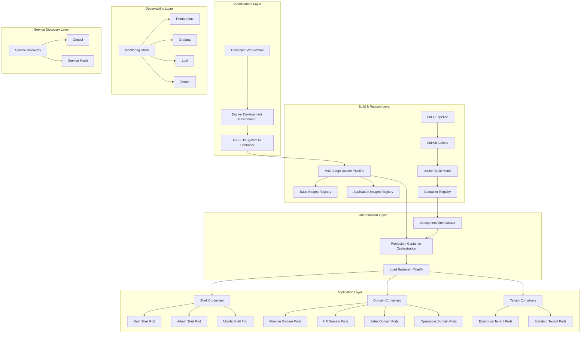
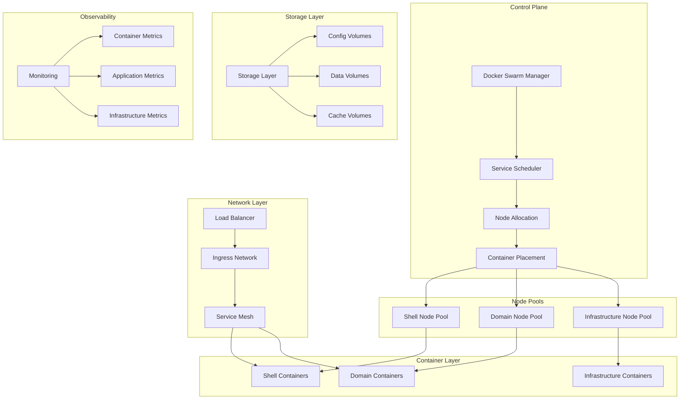
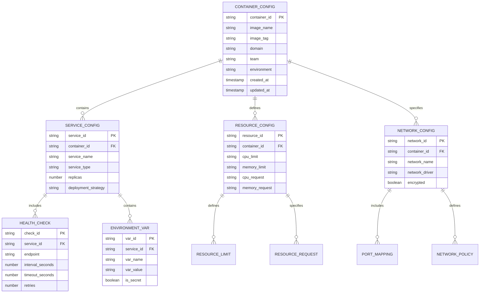

# Technical Architecture for Dockerized Zionix Micro-Frontend Platform

## 1. Architecture Design



## 2. Technology Description

- **Container Runtime**: Docker 24+ with BuildKit for optimized builds
- **Orchestration**: Docker Swarm for production deployment and scaling
- **Base Images**: Alpine Linux for minimal footprint and security
- **Build System**: NX workspace with Docker multi-stage builds
- **Load Balancer**: Traefik v2.9 with automatic service discovery
- **Service Discovery**: Consul for dynamic service registration
- **Monitoring**: Prometheus + Grafana + Loki + Jaeger for observability
- **CI/CD**: GitHub Actions with matrix builds for parallel processing
- **Registry**: GitHub Container Registry (GHCR) for image storage
- **Security**: Trivy + Snyk for vulnerability scanning
- **Networking**: Overlay networks with encryption for multi-tenant isolation
- **Storage**: Docker volumes with NFS for shared configuration
- **Backup**: Automated container and configuration backup to S3

## 3. Container Service Definitions

| Service Type | Container Name | Port | Purpose | Scaling Strategy |
|--------------|----------------|------|---------|------------------|
| Shell | `main-shell` | 80 | Primary application shell | 3-10 replicas based on load |
| Shell | `admin-shell` | 80 | Administrative interface | 2-5 replicas |
| Shell | `mobile-shell` | 80 | Mobile-optimized shell | 2-8 replicas |
| Domain | `finance-accounting` | 80 | Finance team applications | 2-6 replicas |
| Domain | `finance-treasury` | 80 | Treasury team applications | 1-4 replicas |
| Domain | `hr-recruitment` | 80 | HR recruitment applications | 2-5 replicas |
| Domain | `hr-payroll` | 80 | Payroll applications | 1-3 replicas |
| Domain | `sales-crm` | 80 | CRM applications | 2-8 replicas |
| Domain | `sales-analytics` | 80 | Sales analytics | 1-4 replicas |
| Domain | `operations-monitoring` | 80 | Operations monitoring | 2-4 replicas |
| Infrastructure | `traefik` | 80,443,8080 | Load balancer and routing | 2-3 replicas |
| Infrastructure | `consul` | 8500 | Service discovery | 3 replicas (cluster) |
| Infrastructure | `prometheus` | 9090 | Metrics collection | 2 replicas |
| Infrastructure | `grafana` | 3000 | Monitoring dashboard | 2 replicas |
| Infrastructure | `loki` | 3100 | Log aggregation | 2 replicas |

## 4. Container API Definitions

### 4.1 Container Health Check APIs

**Health Check Endpoint**
```
GET /health
```

Response:
| Field | Type | Description |
|-------|------|-------------|
| status | string | "healthy" or "unhealthy" |
| timestamp | string | ISO 8601 timestamp |
| version | string | Container image version |
| uptime | number | Container uptime in seconds |
| dependencies | object | Status of external dependencies |

Example:
```json
{
  "status": "healthy",
  "timestamp": "2024-01-15T10:30:00Z",
  "version": "1.2.3",
  "uptime": 3600,
  "dependencies": {
    "database": "healthy",
    "redis": "healthy",
    "external_api": "degraded"
  }
}
```

**Readiness Check Endpoint**
```
GET /ready
```

Response:
| Field | Type | Description |
|-------|------|-------------|
| ready | boolean | Container readiness status |
| checks | array | List of readiness checks |

Example:
```json
{
  "ready": true,
  "checks": [
    {"name": "module_federation", "status": "ready"},
    {"name": "static_assets", "status": "ready"},
    {"name": "configuration", "status": "ready"}
  ]
}
```

### 4.2 Container Management APIs

**Container Metrics Endpoint**
```
GET /metrics
```

Response: Prometheus-formatted metrics

**Container Configuration Endpoint**
```
GET /config
```

Response:
| Field | Type | Description |
|-------|------|-------------|
| domain | string | Application domain |
| team | string | Team identifier |
| environment | string | Deployment environment |
| features | object | Enabled feature flags |

### 4.3 Service Discovery APIs

**Service Registration**
```
POST /api/services/register
```

Request:
| Field | Type | Required | Description |
|-------|------|----------|-------------|
| service_id | string | true | Unique service identifier |
| service_name | string | true | Service name |
| address | string | true | Service IP address |
| port | number | true | Service port |
| tags | array | false | Service tags |
| health_check | object | false | Health check configuration |

**Service Discovery**
```
GET /api/services/discover?domain={domain}&team={team}
```

Response:
| Field | Type | Description |
|-------|------|-------------|
| services | array | List of discovered services |
| total | number | Total number of services |

## 5. Container Orchestration Architecture



## 6. Data Model for Container Configuration

### 6.1 Container Configuration Schema



### 6.2 Container Configuration DDL

**Container Configuration Tables**
```sql
-- Container configuration table
CREATE TABLE container_configs (
    container_id UUID PRIMARY KEY DEFAULT gen_random_uuid(),
    image_name VARCHAR(255) NOT NULL,
    image_tag VARCHAR(100) NOT NULL,
    domain VARCHAR(100) NOT NULL,
    team VARCHAR(100) NOT NULL,
    environment VARCHAR(50) NOT NULL CHECK (environment IN ('dev', 'staging', 'prod')),
    created_at TIMESTAMP WITH TIME ZONE DEFAULT NOW(),
    updated_at TIMESTAMP WITH TIME ZONE DEFAULT NOW()
);

-- Service configuration table
CREATE TABLE service_configs (
    service_id UUID PRIMARY KEY DEFAULT gen_random_uuid(),
    container_id UUID REFERENCES container_configs(container_id),
    service_name VARCHAR(255) NOT NULL,
    service_type VARCHAR(100) NOT NULL CHECK (service_type IN ('shell', 'domain', 'infrastructure')),
    replicas INTEGER DEFAULT 1 CHECK (replicas > 0),
    deployment_strategy VARCHAR(50) DEFAULT 'rolling' CHECK (deployment_strategy IN ('rolling', 'blue_green', 'canary')),
    created_at TIMESTAMP WITH TIME ZONE DEFAULT NOW()
);

-- Resource configuration table
CREATE TABLE resource_configs (
    resource_id UUID PRIMARY KEY DEFAULT gen_random_uuid(),
    container_id UUID REFERENCES container_configs(container_id),
    cpu_limit VARCHAR(20) DEFAULT '0.5',
    memory_limit VARCHAR(20) DEFAULT '512M',
    cpu_request VARCHAR(20) DEFAULT '0.1',
    memory_request VARCHAR(20) DEFAULT '128M',
    created_at TIMESTAMP WITH TIME ZONE DEFAULT NOW()
);

-- Network configuration table
CREATE TABLE network_configs (
    network_id UUID PRIMARY KEY DEFAULT gen_random_uuid(),
    container_id UUID REFERENCES container_configs(container_id),
    network_name VARCHAR(255) NOT NULL,
    network_driver VARCHAR(50) DEFAULT 'overlay',
    encrypted BOOLEAN DEFAULT false,
    created_at TIMESTAMP WITH TIME ZONE DEFAULT NOW()
);

-- Health check configuration table
CREATE TABLE health_checks (
    check_id UUID PRIMARY KEY DEFAULT gen_random_uuid(),
    service_id UUID REFERENCES service_configs(service_id),
    endpoint VARCHAR(255) DEFAULT '/health',
    interval_seconds INTEGER DEFAULT 30,
    timeout_seconds INTEGER DEFAULT 10,
    retries INTEGER DEFAULT 3,
    created_at TIMESTAMP WITH TIME ZONE DEFAULT NOW()
);

-- Environment variables table
CREATE TABLE environment_vars (
    var_id UUID PRIMARY KEY DEFAULT gen_random_uuid(),
    service_id UUID REFERENCES service_configs(service_id),
    var_name VARCHAR(255) NOT NULL,
    var_value TEXT,
    is_secret BOOLEAN DEFAULT false,
    created_at TIMESTAMP WITH TIME ZONE DEFAULT NOW()
);

-- Indexes for performance
CREATE INDEX idx_container_configs_domain_team ON container_configs(domain, team);
CREATE INDEX idx_container_configs_environment ON container_configs(environment);
CREATE INDEX idx_service_configs_container_id ON service_configs(container_id);
CREATE INDEX idx_service_configs_type ON service_configs(service_type);
CREATE INDEX idx_resource_configs_container_id ON resource_configs(container_id);
CREATE INDEX idx_network_configs_container_id ON network_configs(container_id);
CREATE INDEX idx_health_checks_service_id ON health_checks(service_id);
CREATE INDEX idx_environment_vars_service_id ON environment_vars(service_id);

-- Initial configuration data
INSERT INTO container_configs (image_name, image_tag, domain, team, environment) VALUES
('zionix/main-shell', 'latest', 'platform', 'shell', 'prod'),
('zionix/admin-shell', 'latest', 'platform', 'shell', 'prod'),
('zionix/finance-accounting', 'latest', 'finance', 'accounting', 'prod'),
('zionix/finance-treasury', 'latest', 'finance', 'treasury', 'prod'),
('zionix/hr-recruitment', 'latest', 'hr', 'recruitment', 'prod'),
('zionix/hr-payroll', 'latest', 'hr', 'payroll', 'prod'),
('zionix/sales-crm', 'latest', 'sales', 'crm', 'prod'),
('zionix/sales-analytics', 'latest', 'sales', 'analytics', 'prod'),
('zionix/operations-monitoring', 'latest', 'operations', 'monitoring', 'prod');

-- Service configurations
INSERT INTO service_configs (container_id, service_name, service_type, replicas) 
SELECT container_id, 
       CASE 
         WHEN domain = 'platform' THEN image_name
         ELSE domain || '-' || team
       END,
       CASE 
         WHEN domain = 'platform' THEN 'shell'
         ELSE 'domain'
       END,
       CASE 
         WHEN image_name LIKE '%main-shell%' THEN 3
         WHEN image_name LIKE '%admin-shell%' THEN 2
         ELSE 2
       END
FROM container_configs;

-- Resource configurations
INSERT INTO resource_configs (container_id, cpu_limit, memory_limit, cpu_request, memory_request)
SELECT container_id,
       CASE 
         WHEN domain = 'platform' THEN '1.0'
         ELSE '0.5'
       END,
       CASE 
         WHEN domain = 'platform' THEN '1G'
         ELSE '512M'
       END,
       CASE 
         WHEN domain = 'platform' THEN '0.5'
         ELSE '0.25'
       END,
       CASE 
         WHEN domain = 'platform' THEN '512M'
         ELSE '256M'
       END
FROM container_configs;

-- Health checks
INSERT INTO health_checks (service_id, endpoint, interval_seconds, timeout_seconds, retries)
SELECT service_id, '/health', 30, 10, 3
FROM service_configs;

-- Environment variables
INSERT INTO environment_vars (service_id, var_name, var_value, is_secret) VALUES
((SELECT service_id FROM service_configs WHERE service_name = 'main-shell'), 'NODE_ENV', 'production', false),
((SELECT service_id FROM service_configs WHERE service_name = 'main-shell'), 'CDN_BASE_URL', 'https://cdn.zionix.com', false),
((SELECT service_id FROM service_configs WHERE service_name = 'finance-accounting'), 'DOMAIN', 'finance', false),
((SELECT service_id FROM service_configs WHERE service_name = 'finance-accounting'), 'TEAM', 'accounting', false);
```

## 7. Container Security Implementation

### 7.1 Security Hardening Configuration

**Security Policy Configuration**
```yaml
# Container security policies
security_policies:
  base_image:
    - use_minimal_base_images: true
    - scan_for_vulnerabilities: true
    - update_regularly: true
    
  runtime:
    - run_as_non_root: true
    - read_only_filesystem: true
    - no_privileged_containers: true
    - drop_all_capabilities: true
    
  network:
    - encrypt_overlay_networks: true
    - isolate_tenant_networks: true
    - restrict_egress_traffic: true
    
  secrets:
    - use_docker_secrets: true
    - rotate_secrets_regularly: true
    - encrypt_secrets_at_rest: true
```

### 7.2 Container Compliance Framework

**Compliance Monitoring Configuration**
```yaml
# Compliance monitoring for containers
compliance_checks:
  cis_docker_benchmark:
    - check_docker_daemon_configuration: true
    - verify_container_runtime_security: true
    - audit_docker_files_and_directories: true
    
  security_scanning:
    - vulnerability_scanning: daily
    - malware_scanning: weekly
    - configuration_drift_detection: continuous
    
  audit_logging:
    - container_lifecycle_events: true
    - security_events: true
    - access_control_events: true
```

## 8. Performance Optimization Strategy

### 8.1 Container Performance Tuning

**Performance Configuration Matrix**
```yaml
performance_profiles:
  high_traffic:
    cpu_limit: "2.0"
    memory_limit: "2G"
    cpu_request: "1.0"
    memory_request: "1G"
    replicas: 5
    
  medium_traffic:
    cpu_limit: "1.0"
    memory_limit: "1G"
    cpu_request: "0.5"
    memory_request: "512M"
    replicas: 3
    
  low_traffic:
    cpu_limit: "0.5"
    memory_limit: "512M"
    cpu_request: "0.25"
    memory_request: "256M"
    replicas: 2
```

### 8.2 Auto-scaling Configuration

**Horizontal Pod Autoscaler Configuration**
```yaml
autoscaling_rules:
  cpu_based:
    target_cpu_utilization: 70
    min_replicas: 2
    max_replicas: 10
    scale_up_stabilization: 60s
    scale_down_stabilization: 300s
    
  memory_based:
    target_memory_utilization: 80
    min_replicas: 2
    max_replicas: 8
    
  custom_metrics:
    request_rate:
      target_value: 1000
      metric_name: "http_requests_per_second"
```

## 9. Disaster Recovery Implementation

### 9.1 Backup Strategy

**Container Backup Configuration**
```yaml
backup_strategy:
  container_images:
    frequency: daily
    retention: 30_days
    storage: s3://zionix-backups/images/
    
  configuration:
    frequency: hourly
    retention: 7_days
    storage: s3://zionix-backups/config/
    
  persistent_data:
    frequency: every_6_hours
    retention: 14_days
    storage: s3://zionix-backups/data/
```

### 9.2 Recovery Procedures

**Disaster Recovery Runbook**
```yaml
recovery_procedures:
  container_failure:
    detection_time: 30_seconds
    automatic_restart: true
    escalation_threshold: 3_failures
    
  node_failure:
    detection_time: 60_seconds
    automatic_rescheduling: true
    data_recovery: from_backup
    
  cluster_failure:
    detection_time: 120_seconds
    recovery_method: restore_from_backup
    rto: 4_hours
    rpo: 1_hour
```

This technical architecture document provides the detailed implementation framework for containerizing the Zionix micro-frontend platform, ensuring scalability, security, and operational excellence at enterprise scale.