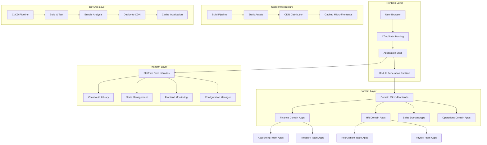
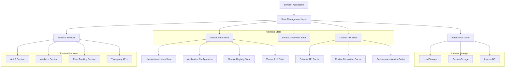
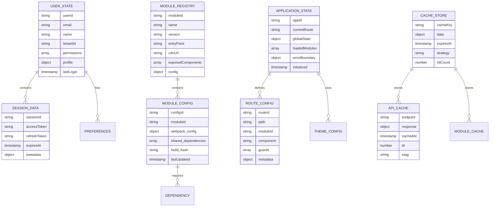

# Frontend-Only Technical Implementation Architecture for Enterprise Micro-Frontend Platform

## 1. Architecture Design



## 2. Technology Description

- **Frontend**: NX workspace React 18+ + Javascript + Module Federation + antd + framermotion + remix for icons
- **Build Tool**: NX + Module Federation
- **State Management**: Zustand (lightweight) + React Query (for external APIs)
- **Testing**: Jest + React Testing Library + Playwright (E2E)
- **UI Framework**: Ant Design (antd) for components and styling
- **Animations**: Framer Motion for smooth transitions and interactions
- **Icons**: Remix Icons for comprehensive icon library
- **Static Hosting**: AWS S3 + CloudFront CDN
- **CI/CD**: GitHub Actions + Static deployment
- **Monitoring**: Sentry (error tracking) + Google Analytics + Custom frontend metrics
- **Authentication**: Auth0 (client-side) + JWT tokens
- **Data Storage**: LocalStorage + IndexedDB + External APIs
- **Package Management**: npm workspaces

## 3. Route Definitions

| Route Pattern | Purpose | Team Access |
|---------------|---------|-------------|
| `/` | Main application shell and dashboard | All authenticated users |
| `/auth/*` | Authentication flows (login, logout, SSO) | Public |
| `/finance/accounting/*` | Accounting team applications | Finance domain teams |
| `/finance/treasury/*` | Treasury team applications | Finance domain teams |
| `/hr/recruitment/*` | Recruitment team applications | HR domain teams |
| `/hr/payroll/*` | Payroll team applications | HR domain teams |
| `/sales/crm/*` | CRM team applications | Sales domain teams |
| `/sales/analytics/*` | Sales analytics applications | Sales domain teams |
| `/operations/monitoring/*` | Operations monitoring apps | Operations teams |
| `/admin/*` | Platform administration | Platform administrators |
| `/tenant/:tenantId/*` | Tenant-specific applications | Tenant users |

## 4. Frontend Configuration & External APIs

### 4.1 Module Federation Configuration

**Dynamic Module Loading**
```javascript
// platform/core/module-federation/dynamic-loader.js
const loadRemoteModule = async (domain, team, appName, version = 'latest') => {
  const moduleUrl = `https://cdn.zionix.com/${domain}/${team}/${appName}/${version}/remoteEntry.js`;
  
  try {
    const module = await import(moduleUrl);
    return module.default;
  } catch (error) {
    console.error(`Failed to load module: ${domain}/${team}/${appName}`, error);
    return null;
  }
};
```

**Module Registry (Static Configuration)**
```json
{
  "modules": {
    "finance-accounting-invoice": {
      "domain": "finance",
      "team": "accounting", 
      "name": "invoice",
      "version": "1.2.3",
      "url": "https://cdn.zionix.com/finance/accounting/invoice/1.2.3/remoteEntry.js",
      "permissions": ["finance:accounting:read", "finance:accounting:write"]
    },
    "hr-recruitment-portal": {
      "domain": "hr",
      "team": "recruitment",
      "name": "portal", 
      "version": "2.1.0",
      "url": "https://cdn.zionix.com/hr/recruitment/portal/2.1.0/remoteEntry.js",
      "permissions": ["hr:recruitment:read"]
    }
  }
}
```

### 4.2 Client-Side Configuration

**Application Configuration (Static)**
```javascript
// platform/core/config/app-config.js
const AppConfig = {
  auth: {
    provider: 'auth0',
    domain: 'zionix.auth0.com',
    clientId: 'your-auth0-client-id',
    redirectUri: window.location.origin
  },
  analytics: {
    googleAnalyticsId: 'GA-XXXXXXXXX',
    sentryDsn: 'https://your-sentry-dsn'
  },
  features: {
    enableDarkMode: true,
    enableNotifications: true,
    maxConcurrentApps: 5
  },
  cdn: {
    baseUrl: 'https://cdn.zionix.com',
    fallbackUrl: 'https://backup-cdn.zionix.com'
  }
};
```

### 4.3 External API Integration

**Third-Party Services (Examples)**
```javascript
// External APIs that micro-frontends might consume
const ExternalAPIs = {
  // Authentication
  auth0: 'https://zionix.auth0.com',
  
  // Analytics & Monitoring
  googleAnalytics: 'https://www.google-analytics.com',
  sentry: 'https://sentry.io/api',
  
  // Business APIs (external services)
  salesforce: 'https://api.salesforce.com',
  stripe: 'https://api.stripe.com',
  slack: 'https://slack.com/api',
  
  // Data Sources
  publicAPIs: {
    weather: 'https://api.openweathermap.org',
    currency: 'https://api.exchangerate-api.com'
  }
};
```

**Error Tracking**
```
POST /api/v1/errors/report
```

Request:
| Param Name | Param Type | isRequired | Description |
|------------|------------|------------|-------------|
| error | ErrorInfo | true | Error information |
| context | ErrorContext | true | Error context |
| stackTrace | string | false | Error stack trace |

## 5. Frontend State Management Architecture



## 6. Frontend Data Model

### 6.1 Client-Side Data Structure



### 6.2 Frontend Data Storage Implementation

**LocalStorage Schema**

```javascript
// User authentication and session data
const userStorageSchema = {
  'auth_user': {
    userId: 'string',
    email: 'string',
    name: 'string',
    tenantId: 'string',
    permissions: 'array',
    profile: 'object',
    lastLogin: 'timestamp'
  },
  'auth_session': {
    sessionId: 'string',
    accessToken: 'string',
    refreshToken: 'string',
    expiresAt: 'timestamp',
    metadata: 'object'
  },
  'user_preferences': {
    theme: 'string',
    language: 'string',
    notifications: 'object',
    layout: 'object'
  }
};

// Application configuration
const appStorageSchema = {
  'app_config': {
    appId: 'string',
    currentRoute: 'string',
    globalState: 'object',
    loadedModules: 'array',
    errorBoundary: 'object',
    initialized: 'timestamp'
  },
  'module_registry': {
    modules: 'array', // Array of module configurations
    lastUpdated: 'timestamp',
    version: 'string'
  }
};
```

**IndexedDB Schema**

```javascript
// Module and asset caching
const indexedDBSchema = {
  stores: {
    'module_cache': {
      keyPath: 'moduleId',
      indexes: {
        'version': { unique: false },
        'lastAccessed': { unique: false }
      },
      structure: {
        moduleId: 'string',
        name: 'string',
        version: 'string',
        entryPoint: 'string',
        cdnUrl: 'string',
        exposedComponents: 'array',
        config: 'object',
        cachedAt: 'timestamp',
        lastAccessed: 'timestamp'
      }
    },
    'api_cache': {
      keyPath: 'cacheKey',
      indexes: {
        'endpoint': { unique: false },
        'expiresAt': { unique: false }
      },
      structure: {
        cacheKey: 'string',
        endpoint: 'string',
        response: 'object',
        cachedAt: 'timestamp',
        expiresAt: 'timestamp',
        ttl: 'number',
        etag: 'string'
      }
    },
    'performance_metrics': {
      keyPath: 'metricId',
      indexes: {
        'moduleId': { unique: false },
        'timestamp': { unique: false }
      },
      structure: {
        metricId: 'string',
        moduleId: 'string',
        metricType: 'string', // 'load_time', 'bundle_size', 'error_rate'
        value: 'number',
        timestamp: 'timestamp',
        metadata: 'object'
      }
    }
  }
};
```

**Static Configuration Files**

```javascript
// Module registry configuration (static JSON)
const moduleRegistryConfig = {
  "version": "1.0.0",
  "lastUpdated": "2024-01-15T10:30:00Z",
  "modules": [
    {
      "moduleId": "finance-dashboard",
      "name": "Finance Dashboard",
      "version": "2.1.0",
      "entryPoint": "https://cdn.zionix.com/modules/finance-dashboard/2.1.0/remoteEntry.js",
      "cdnUrl": "https://cdn.zionix.com/modules/finance-dashboard/2.1.0/",
      "exposedComponents": ["Dashboard", "Reports", "Analytics"],
      "config": {
        "webpack": {
          "shared": ["react", "react-dom", "@zionix/ui-components"]
        },
        "permissions": ["finance:read", "finance:dashboard:write"],
        "routes": ["/finance", "/finance/dashboard", "/finance/reports"]
      }
    }
  ]
};

// Application configuration (static JSON)
const appConfig = {
  "authentication": {
    "provider": "auth0",
    "domain": "zionix.auth0.com",
    "clientId": "your-auth0-client-id",
    "audience": "https://api.zionix.com"
  },
  "analytics": {
    "provider": "google-analytics",
    "trackingId": "GA-XXXXXXXX-X",
    "customEvents": true
  },
  "features": {
    "moduleHotReload": true,
    "performanceMonitoring": true,
    "errorBoundaries": true,
    "lazyLoading": true
  },
  "cdn": {
    "baseUrl": "https://cdn.zionix.com",
    "version": "latest",
    "fallbackUrls": [
      "https://backup-cdn.zionix.com",
      "https://local-assets.zionix.com"
    ]
  }
};
```

**Frontend Data Management Classes**

```javascript
// Storage manager for client-side data
class FrontendStorageManager {
  constructor() {
    this.localStorage = window.localStorage;
    this.sessionStorage = window.sessionStorage;
    this.indexedDB = null;
    this.initIndexedDB();
  }

  async initIndexedDB() {
    const request = indexedDB.open('ZionixMicroFrontend', 1);
    
    request.onupgradeneeded = (event) => {
      const db = event.target.result;
      
      // Create module cache store
      const moduleStore = db.createObjectStore('module_cache', { keyPath: 'moduleId' });
      moduleStore.createIndex('version', 'version', { unique: false });
      moduleStore.createIndex('lastAccessed', 'lastAccessed', { unique: false });
      
      // Create API cache store
      const apiStore = db.createObjectStore('api_cache', { keyPath: 'cacheKey' });
      apiStore.createIndex('endpoint', 'endpoint', { unique: false });
      apiStore.createIndex('expiresAt', 'expiresAt', { unique: false });
      
      // Create performance metrics store
      const metricsStore = db.createObjectStore('performance_metrics', { keyPath: 'metricId' });
      metricsStore.createIndex('moduleId', 'moduleId', { unique: false });
      metricsStore.createIndex('timestamp', 'timestamp', { unique: false });
    };
    
    return new Promise((resolve, reject) => {
      request.onsuccess = () => {
        this.indexedDB = request.result;
        resolve(this.indexedDB);
      };
      request.onerror = () => reject(request.error);
    });
  }

  // Cache module data
  async cacheModule(moduleData) {
    const transaction = this.indexedDB.transaction(['module_cache'], 'readwrite');
    const store = transaction.objectStore('module_cache');
    
    const cacheEntry = {
      ...moduleData,
      cachedAt: new Date().toISOString(),
      lastAccessed: new Date().toISOString()
    };
    
    return store.put(cacheEntry);
  }

  // Get cached module
  async getCachedModule(moduleId) {
    const transaction = this.indexedDB.transaction(['module_cache'], 'readonly');
    const store = transaction.objectStore('module_cache');
    
    return new Promise((resolve, reject) => {
      const request = store.get(moduleId);
      request.onsuccess = () => {
        if (request.result) {
          // Update last accessed time
          this.updateModuleAccess(moduleId);
        }
        resolve(request.result);
      };
      request.onerror = () => reject(request.error);
    });
  }

  // Store performance metrics
  async storeMetric(moduleId, metricType, value, metadata = {}) {
    const transaction = this.indexedDB.transaction(['performance_metrics'], 'readwrite');
    const store = transaction.objectStore('performance_metrics');
    
    const metric = {
      metricId: `${moduleId}_${metricType}_${Date.now()}`,
      moduleId,
      metricType,
      value,
      timestamp: new Date().toISOString(),
      metadata
    };
    
    return store.put(metric);
  }
}
```

This frontend-only technical architecture provides a comprehensive framework for managing client-side data, caching, and state management for the enterprise micro-frontend platform, ensuring optimal performance and user experience for 10,000+ applications without any backend dependencies.